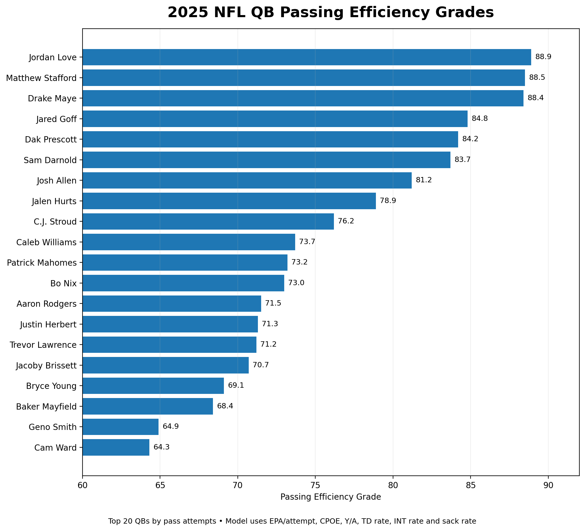
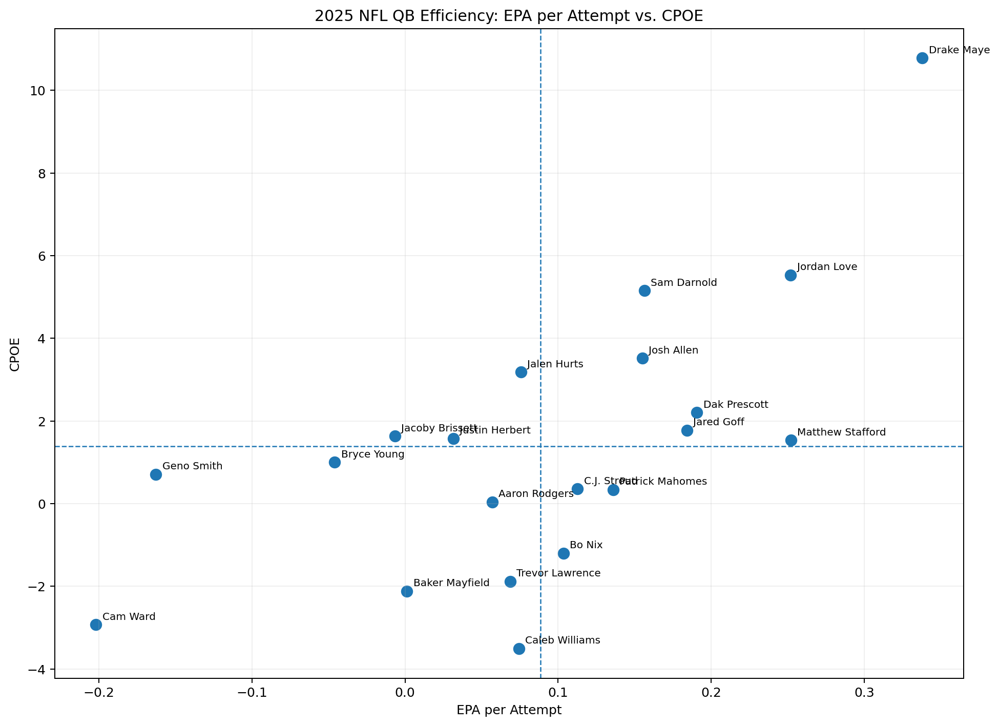

# 2025 NFL Quarterback Efficiency Analysis

This is my first independent sports analytics project.

I wanted to answer a simple question: **if I focus on passing efficiency instead of reputation, what does the 2025 season say about the NFL's high-volume quarterbacks?**

## What I did

I used 2025 regular-season player data from **nflverse** and selected the 20 quarterbacks with the most pass attempts. I compared them using six metrics:

| Metric | Weight |
|---|---:|
| EPA per attempt | 30% |
| CPOE | 20% |
| Yards per attempt | 15% |
| TD rate | 10% |
| INT rate | 10% |
| Sack rate | 15% |

I converted each metric to a percentile within the 20-QB sample so stats measured on different scales could be compared. INT rate and sack rate are reversed because lower is better.

I then rescaled the final result into a more intuitive football-style grade where the middle of this sample is around **75**. The rescaling changes how the number looks, but it does **not** change the ranking.

## QB rankings

| Rank | Quarterback | Team | Grade |
|---:|---|:---:|---:|
| 1 | Jordan Love | GB | **88.9** |
| 2 | Matthew Stafford | LA | **88.5** |
| 3 | Drake Maye | NE | **88.4** |
| 4 | Jared Goff | DET | **84.8** |
| 5 | Dak Prescott | DAL | **84.2** |
| 6 | Sam Darnold | SEA | **83.7** |
| 7 | Josh Allen | BUF | **81.2** |
| 8 | Jalen Hurts | PHI | **78.9** |
| 9 | C.J. Stroud | HOU | **76.2** |
| 10 | Caleb Williams | CHI | **73.7** |
| 11 | Patrick Mahomes | KC | **73.2** |
| 12 | Bo Nix | DEN | **73.0** |
| 13 | Aaron Rodgers | PIT | **71.5** |
| 14 | Justin Herbert | LAC | **71.3** |
| 15 | Trevor Lawrence | JAX | **71.2** |
| 16 | Jacoby Brissett | ARI | **70.7** |
| 17 | Bryce Young | CAR | **69.1** |
| 18 | Baker Mayfield | TB | **68.4** |
| 19 | Geno Smith | LV | **64.9** |
| 20 | Cam Ward | TEN | **64.3** |

### Passing Efficiency Grades

## What surprised me

The most useful part of the project was not getting a final ranking. It was seeing where the model disagreed with what I expected.

For example, a player such as Patrick Mahomes grading lower than his reputation does not automatically mean the model is right. It makes me ask **why**. Is the model missing rushing value? Does situation matter? Is one metric being weighted too heavily? That is the part of analytics I find most interesting.

### EPA per Attempt vs. CPOE

This chart helped me see which quarterbacks were creating efficient plays while also completing passes above expectation.

## Houston's Take

I wrote a short note on every quarterback in `results/houstons_take.csv`. Those notes are not supposed to be objective facts. They are my interpretation of what the model is telling me and what I would investigate next.

## Limitations

This is a **passing-efficiency model**, not an overall quarterback rating.

The current version does not fully account for:

- rushing value
- offensive line quality
- receiver quality
- offensive scheme
- opponent strength
- game situation
- injuries
- pressure-specific performance

That matters for players whose value extends well beyond traditional passing efficiency.

## What I would add next

My next version would add rushing EPA, pressure splits, situation-neutral play-by-play analysis, opponent adjustment and more context for supporting cast. I would also test the same model on another season to see whether the results are stable.

## Files

- `analysis.py` — readable Python version of the model
- `data/stats_player_reg_2025.csv` — source data used in the project
- `results/qb_rankings.csv` — final 20-QB ranking
- `results/houstons_take.csv` — my interpretation of each result
- `charts/2025_qb_passing_efficiency_grades.png` — grade visualization
- `charts/2025_qb_epa_vs_cpoe.png` — EPA/CPOE comparison

## Data source

Data comes from the **nflverse** project. nflverse distributes player statistics through its automated data releases. This project uses the supplied 2025 regular-season player-summary CSV.

This is a learning/portfolio project, not a claim that the model is a definitive ranking of NFL quarterbacks.
